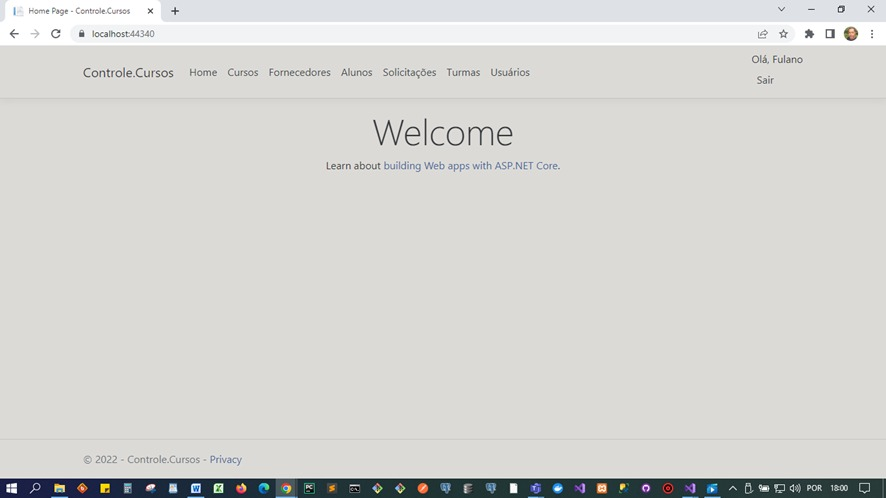
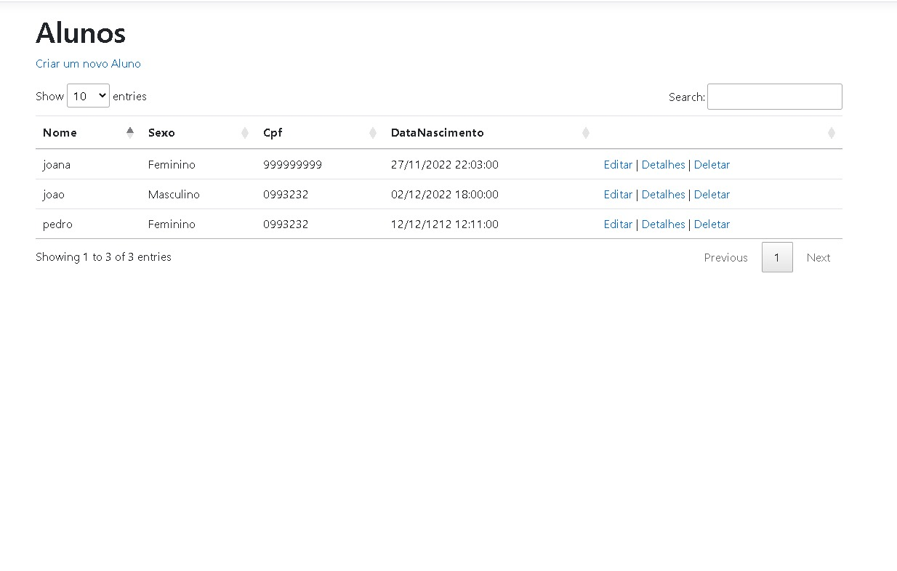
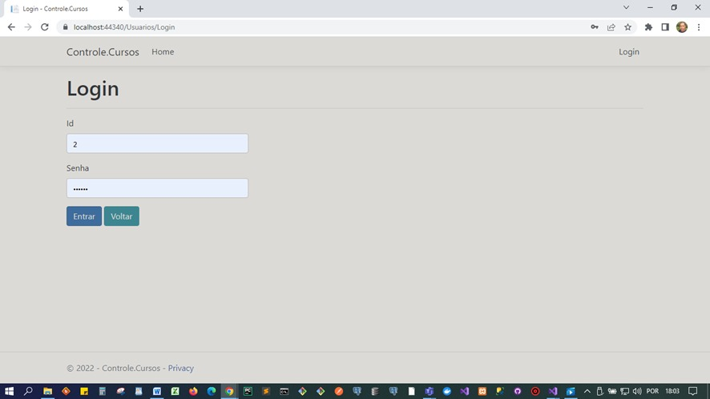
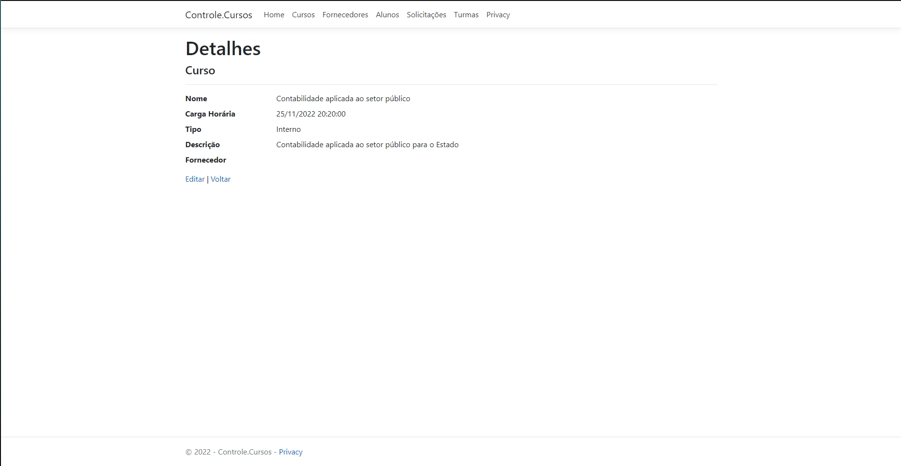
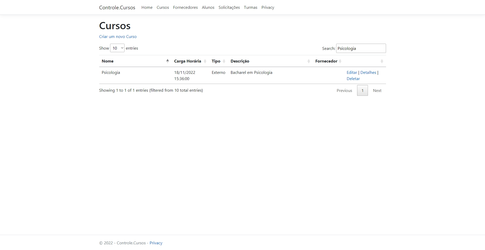
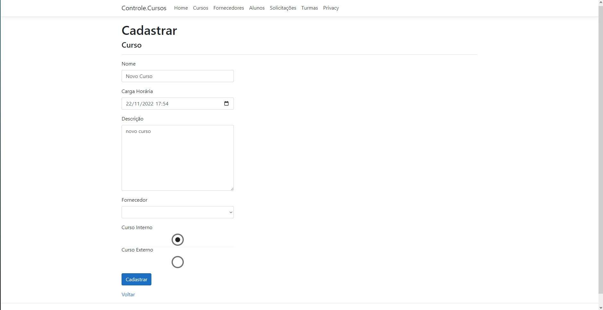
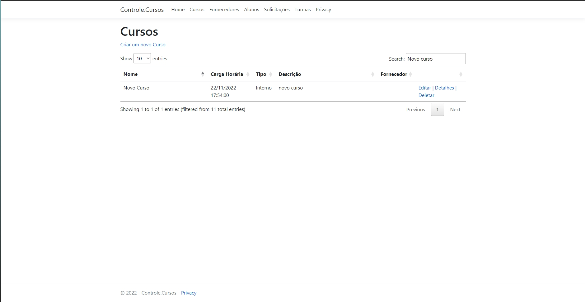
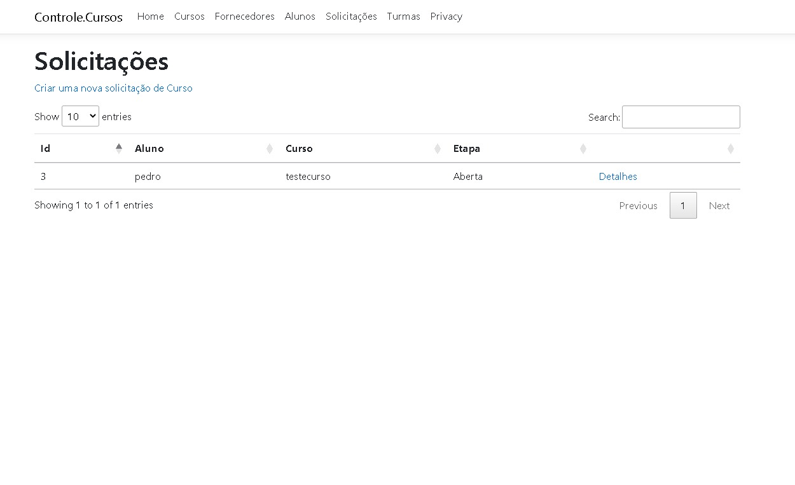

# Registro de Testes de Software

Considerando os requisitos do projeto e os casos listados no item [08. Plano de Testes de Software](https://github.com/ICEI-PUC-Minas-PMV-ADS/pmv-ads-2022-2-e2-proj-int-t1-controle_de_cursos/blob/main/docs/08-Plano%20de%20Testes%20de%20Software.md), foram realizados os testes descritos abaixo:

| **Caso de Teste** 	| **CT-01 – Acesso a página "Home e cadastro"** 	|
|:---:	|:---:	|
|	Requisito Associado 	| RF-01 - Deve possuir tela "Home" e fornecer acesso a página de cadastro de servidores efetivos e comissionados (alunos) e também login para alunos já cadastrados. |
| Objetivo do Teste 	| Acessar a página "Home" e utilizar suas funcionalidades |
| Passos 	| - Acessar o sistema   - Clicar em fazer cadastro (opção para servidores efetivos e alunos)   - Preencher os campos obrigatórios   - Clicar em "Registrar" |
|Critério de Êxito | - O cadastro foi realizado com sucesso. |
| Print do Teste | 
|Conclusão do teste | Teste realizado com sucesso. O cadastro foi realizado com sucesso.
|  	|  	|
| **Caso de Teste** 	| **CT-02 – Efetuar login**	|
|Requisito Associado | RF-01 - Deve possuir tela "Home" e fornecer acesso a página de cadastro de servidores efetivos e comissionados (alunos) e também login para alunos já cadastrados. |
| Objetivo do Teste 	| Verificar se o usuário é capaz de realizar login. |
| Passos 	| - Acessar o sistema   - Clicar no botão de Login   - Preencher o campo de CPF   - Preencher o campo da senha   -   - Clicar em "Login" |
|Critério de Êxito | - O login foi realizado com sucesso. |
| Print do Teste | 
|Conclusão do teste | Teste realizado com sucesso. O login foi realizado com sucesso.
|  	|  	|
| **Caso de Teste** 	| **CT-03 – Visualizar opções cursos**	|
|Requisito Associado | RF-02	- Deve possibilitar o cadastro de alunos para o acesso a página home logada permitindo a visualização das ofertas de cursos disponíveis. |
| Objetivo do Teste 	| Verificar se o usuário consegue visualizar as opções de cursos disponíveis. |
| Passos 	| - Fazer o login   - Clicar na aba "Cursos" |
|Critério de Êxito | - Visualizar as opções de cursos disponiveis. |
| Print do Teste | 
|Conclusão do teste | Teste realizado com sucesso. Foi possível visualizar as opções de cursos disponiveis.
|  	|  	|
| **Caso de Teste** 	| **CT-04 – Ver detalhes do curso desejado**	|
|Requisito Associado | RF-03	- A aplicação deve possuir a grade de programação de cursos contendo todos as informações específicas de cada curso. |
| Objetivo do Teste 	| Verificar se o usuário consegue acessar o detalhamento dos cursos. |
| Passos 	| - Fazer o login   - Clicar em cursos disponiveis   - Selecionar o curso desejado   - Verificar os detalhes referente ao curso   - Voltar a pagina de cursos |
|Critério de Êxito | - Foi possível visualizar os detalhes do curso |
| Print do Teste | 
|Conclusão do teste | Teste realizado com sucesso. Foi possível visualizar os detalhes do curso
|  	|  	|
| **Caso de Teste** 	| **CT-05 – Filtrar a pesquisa de cursos de acordo com a opção desejada**	|
|Requisito Associado | RF-04	- Deve disponibilizar ao usuário as opções de escolha conforme categoria: cursos externos (parceria com instituições de ensino e contratados por meio de licitação) e cursos internos (desenvolvidos pelos próprios servidores municipais da Administração Direta (Secretarias Municipais e/ou Órgãos) ou pelos servidores das Entidades da Administração Indireta (Autarquias e/ou Fundações). |
| Objetivo do Teste 	| Verificar se o usuário consegue filtrar as opções de curso. |
| Passos 	| - Fazer o login   - Clicar em cursos disponiveis   - Selecionar o filtro de acordo com a opção de curso desejada   - Clicar em filtrar   - Verificar se o sistema retornou a opção desejada. |
|Critério de Êxito | - A pesquisa foi filtrada de acordo com a opção do usuário. |
| Print do Teste | 
|Conclusão do teste | Teste realizado com sucesso. Foi possível filtrar a pesquisa de acordo com a opção do usuário.
|  	|  	|
| **Caso de Teste** 	| **CT-06 – Cadastro de curso**	|
|Requisito Associado | RF-05	- Deve disponibilizar cadastro específico para o fornecedor de curso externo inserir os dados da empresa e a documentação necessária para o cadastramento das propostas de cursos, arquivos necessários à contratação, verificação documental e validação das informações cadastrais. |
| Objetivo do Teste 	| Verificar se o fornecedor de cursos é capaz de cadastrar uma opção de curso. |
| Passos 	| - Acessar o sistema   - Efetuar o login como fornecedor de cursos   - Clicar na opção de cadastrar curso   - Preencher os campos necessários   - Clicar em "Cadastrar curso" |
|Critério de Êxito | - O cadastro do curso foi efetuado com sucesso. |
| Print do Teste |  
|Conclusão do teste | Teste realizado com sucesso. O fornecedor consegue cadastrar um novo curso.
|  	|  	|
| **Caso de Teste** 	| **CT-07 – Acessar histórico de solicitações de cursos**	|
|Requisito Associado | RF-08	- Fornecer página com histórico das solicitações ja realizadas pelo aluno, sejam elas em andamento ou encerradas. |
| Objetivo do Teste 	| Verificar se o fornecedor de cursos é capaz de cadastrar uma opção de curso. |
| Passos 	| - Acessar o sistema   - Efetuar o login como aluno   - Clicar na opção de histórico   - Verificar os cursos em andamento ou encerrados   - Voltar a pagina inicial |
|Critério de Êxito | - Verificação de histórico feita com sucesso. |
| Print do Teste | 
|Conclusão do teste | Teste realizado com sucesso. Foi possível verificar o histórico de solicitações de cursos.
|  	|  	|
